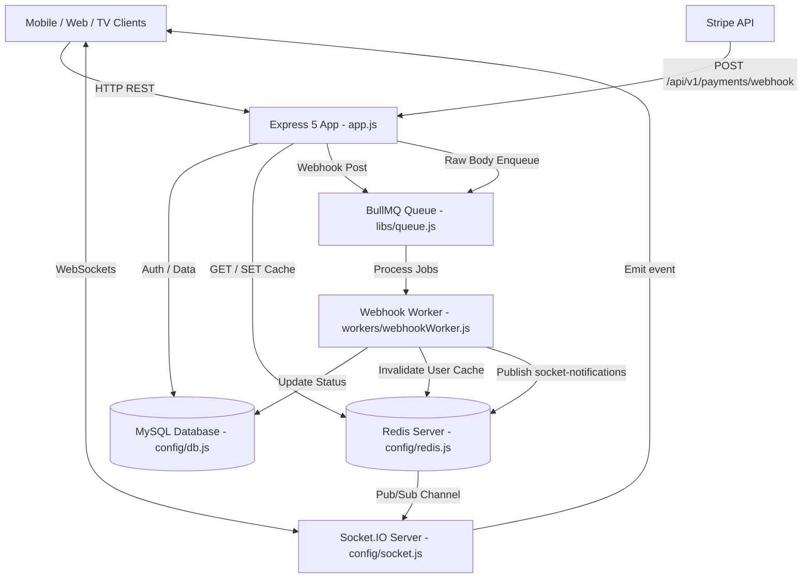

# `edu-api` Technical & Architectural Guide

## Overview

`edu-api` is a high-performance Node.js (ES Modules, Node >= 22) RESTful API and streaming backend powering the Edu Garcia Movimiento platform. It manages user authentication, multi-device profile sessions, content hierarchy (nav pills, collections, modules, syllabus, lessons, videos), Stripe subscription billing with secure webhooks, Redis response caching, Vimeo video metadata synchronization, and realtime Socket.IO notifications.

---

## 1. System Architecture & Component Interaction

The application runs in dual execution modes:
1. **Web HTTP Server** ([index.js](file:///home/runner/work/github_automation/github_automation/workspace_target/index.js)): Express 5 server mounted with Socket.IO realtime server and in-process worker listener.
2. **Standalone Webhook Worker** ([workers/webhookWorker.js](file:///home/runner/work/github_automation/github_automation/workspace_target/workers/webhookWorker.js)): BullMQ consumer processing Stripe background payment events.



---

## 2. Directory & Module Responsibilities

```
edu-api/
├── index.js                  # App bootstrap, HTTP server, Socket.IO init, SIGTERM shutdown
├── app.js                    # Express app middleware setup, raw body route, route mounting
├── swagger.js                # OpenAPI documentation autogeneration script
├── eslint.config.js          # ESLint configuration
├── config/
│   ├── env.js                # Environment variable loader (.env.${NODE_ENV}.local override)
│   ├── db.js                 # mysql2/promise connection pool & retry logic
│   ├── redis.js              # ioredis client setup with retry strategy
│   ├── socket.js             # Socket.IO setup + Redis pub/sub listener & notify helper
│   ├── cloudinary.js         # Cloudinary SDK setup
│   ├── corsOptions.js        # CORS middleware configuration
│   └── allowedOrigins.js     # Whitelisted origins for CORS
├── controllers/              # Business logic & controller route handlers
├── middleware/               # Auth, reset, cache, error middleware
├── routes/                   # Route handlers mapped to paths
├── validators/               # Input validation rules using express-validator
├── libs/                     # Shared infrastructure (Pino logger, BullMQ queue)
├── utils/                    # Shared helper functions and enumerations
└── workers/                  # Stripe webhook BullMQ consumer
```

---

## 3. Critical Architectural Rules & Anti-Patterns

| Rule | Rationale / Risk |
|---|---|
| **DO NOT move `express.raw()` below `express.json()` in [app.js](file:///home/runner/work/github_automation/github_automation/workspace_target/app.js)** | Express body-parser parses raw JSON into an object, breaking Stripe signature verification for webhooks. |
| **DO NOT use `redisClient.keys()` for cache clearing** | `KEYS` is a blocking command in Redis. Use `clearCache(pattern)` which uses `scanStream` iteration. |
| **DO NOT execute raw multi-query operations without `withTransaction`** | Prevents orphaned records in `users`, `user_devices`, `user_profiles`, or `user_subscriptions`. |
| **DO NOT use standard `Error` without `statusCode`** | Unhandled generic errors trigger HTTP 500. Use `createError(msg, statusCode)`. |
| **DO NOT call `socket.emit` directly in worker scripts** | Workers run in a separate process where `io` is null. Always call `socketIO.notify(room, event, data)`. |
