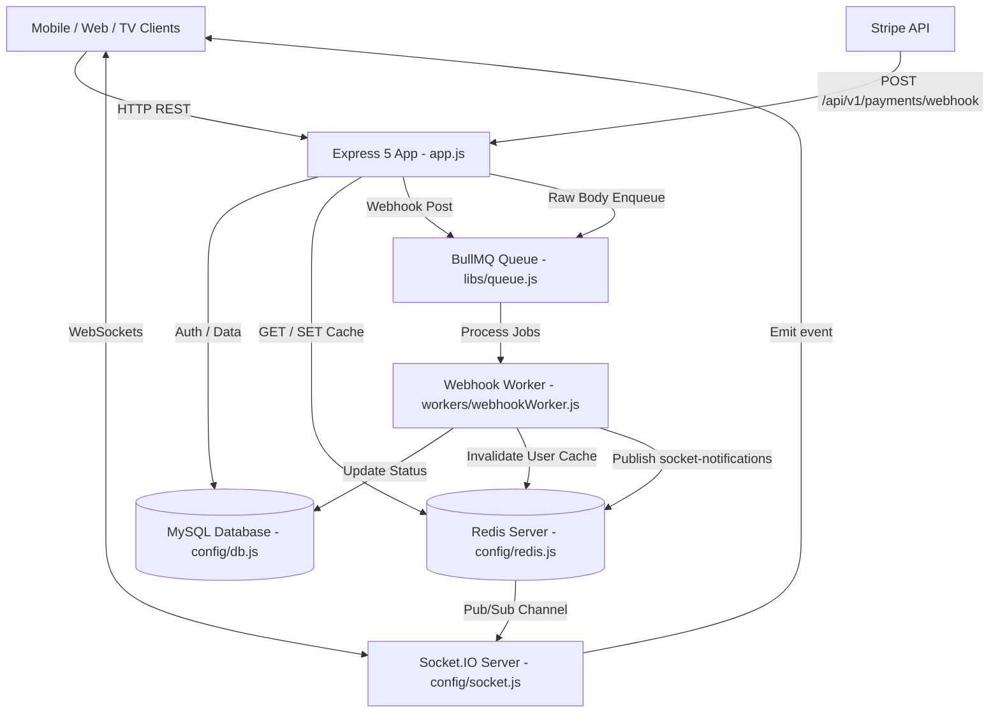
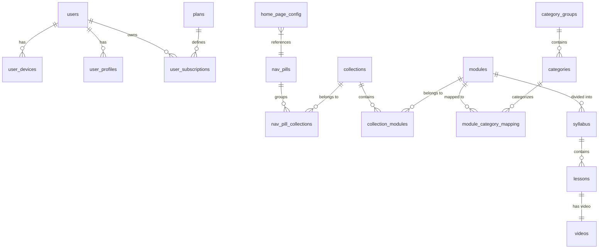

# `edu-api` Technical & Architectural Guide

## Overview

`edu-api` is a high-performance Node.js (ES Modules, Node >= 22) RESTful API and streaming backend powering the Edu Garcia Movimiento platform. It manages user authentication, multi-device profile sessions, content hierarchy (nav pills, collections, modules, syllabus, lessons, videos), Stripe subscription billing with secure webhooks, Redis response caching, Vimeo video metadata synchronization, and realtime Socket.IO notifications.

---

## 1. System Architecture & Component Interaction

The application runs in dual execution modes:
1. **Web HTTP Server** ([index.js](file:///home/runner/work/github_automation/github_automation/workspace_target/index.js)): Express 5 server mounted with Socket.IO realtime server and in-process worker listener.
2. **Standalone Webhook Worker** ([workers/webhookWorker.js](file:///home/runner/work/github_automation/github_automation/workspace_target/workers/webhookWorker.js)): BullMQ consumer processing Stripe background payment events.



---

## 2. Directory & Module Responsibilities

```
edu-api/
├── index.js                  # App bootstrap, HTTP server, Socket.IO init, SIGTERM shutdown
├── app.js                    # Express app middleware setup, raw body route, route mounting
├── swagger.js                # OpenAPI documentation autogeneration script
├── eslint.config.js          # ESLint configuration
├── config/
│   ├── env.js                # Environment variable loader (.env.${NODE_ENV}.local override)
│   ├── db.js                 # mysql2/promise connection pool & retry logic
│   ├── redis.js              # ioredis client setup with retry strategy
│   ├── socket.js             # Socket.IO setup + Redis pub/sub listener & notify helper
│   ├── cloudinary.js         # Cloudinary SDK setup
│   ├── corsOptions.js        # CORS middleware configuration
│   └── allowedOrigins.js     # Whitelisted origins for CORS
├── controllers/              # Business logic & controller route handlers
│   ├── auth.controllers.js     # User registration, login sync, OTP, admin login
│   ├── user.controllers.js     # Home data, search, nav pills, section, modules, lessons
│   ├── admin.controllers.js    # Comprehensive admin CRUD for content hierarchy & plans
│   ├── payment.controllers.js  # Subscription plans, checkout checksum, webhook receiver
│   ├── devices.controllers.js  # Connected devices query and removal
│   ├── profile.controllers.js  # User profile get/update
│   ├── forget.controllers.js   # Password reset requests & completion
│   ├── refresh.controllers.js  # Refresh token exchange for access token
│   ├── logout.controllers.js   # User logout & session termination
│   └── delete.controllers.js   # Remove session by device ID
├── middleware/
│   ├── auth.middleware.js     # JWT Bearer token authentication (ACCESS_TOKEN_SECRET)
│   ├── reset.middleware.js    # JWT Bearer token password reset auth (SHORT_TOKEN_SECRET)
│   ├── cache.middleware.js    # Redis HTTP response caching middleware
│   └── error.middleware.js    # Global Express error handling middleware
├── routes/                   # Route handlers mapped to paths
├── validators/               # Input validation rules using express-validator
├── libs/
│   ├── logger.js             # Pino logger instance (pino-pretty in dev)
│   └── queue.js              # BullMQ 'stripe-webhooks' queue instance
├── utils/
│   ├── authHelper.js         # JWT generation, token cookies, email name generator, reviewer check
│   ├── cache.js              # getOrSetCache & clearCache using Redis SCAN iterator
│   ├── paginationHelper.js   # Cursor & offset pagination helpers, asyncHandler, withTransaction
│   ├── validationHelper.js   # handleValidationErrors, createError, validateIdExists
│   ├── enums.js              # UIStyle, LayoutType, AspectRatio, SubscriptionStatus
│   ├── userRoles.js          # UserRole enum (USER: 2, ADMIN: 1)
│   ├── tableType.js          # TableType enum
│   ├── categoryType.js       # CategoryType enum
│   ├── reasonCode.js         # ReasonCode enum (Auth response descriptions)
│   └── clearCacheScript.js   # Standalone CLI script to clear Redis cache
└── workers/
    └── webhookWorker.js      # Stripe webhook queue consumer & user status updater
```

---

## 3. Database Schemas & Data Model Concept



---

## 4. Coding Conventions & Key Utilities

### 1. Controller Pattern & Error Handling
Controllers MUST use `asyncHandler` and handle validation errors via `handleValidationErrors(req)`:
```javascript
import { asyncHandler, sendSuccess } from '../utils/paginationHelper.js';
import { handleValidationErrors, createError } from '../utils/validationHelper.js';

export const myController = asyncHandler(async (req, res) => {
  handleValidationErrors(req);
  
  if (!somethingValid) {
    throw createError("Resource not found", 404);
  }
  
  return sendSuccess(res, { result: data }, "Success message");
});
```

### 2. Database Transactions
Use `withTransaction` for multi-step atomic operations:
```javascript
import { withTransaction } from '../utils/paginationHelper.js';
import dbConnectionPromise from '../config/db.js';

const result = await withTransaction(dbConnectionPromise, async (connection) => {
  await connection.execute("INSERT INTO users ...", [...]);
  await connection.execute("INSERT INTO user_devices ...", [...]);
  return { userId };
});
```

### 3. Redis Caching & Invalidation
- **Reading/Writing Cache**: `getOrSetCache(key, fetchFn, ttlSeconds)`
- **Invalidating Cache**: `clearCache(pattern)` using Redis `scanStream` (never `KEYS`).

---

## 5. Security & Authentication Architecture

### Secret Key Hierarchy ([config/env.js](file:///home/runner/work/github_automation/github_automation/workspace_target/config/env.js))
- **`ACCESS_TOKEN_SECRET`**: Standard Bearer token authentication.
- **`REFRESH_TOKEN_SECRET`**: Long-lived refresh token stored in HTTP-only cookie (`XXAFIT`) and DB `user_devices.rem_token`.
- **`SHORT_TOKEN_SECRET`**: Password reset authorization.
- **`OTP_TOKEN_SECRET`**: 5-digit numeric OTP token.
- **`WEB_TOKEN_SECRET`**: Web checkout session verification link.
- **`CHECKSUM_SECRET`**: Checkout payload HMAC-SHA256 signature verification.

### Device Fingerprinting & Device Limits
- **Mobile (`android`/`ios`)**: Uses hardware/OS device ID (`android_id` / `IDFV`).
- **Web (`web` or missing `device_id`)**: Computes SHA-256 hash of `${userAgent}:${acceptLanguage}:${ip}`.
- **Device Limit Enforcement**: Each plan specifies `max_screens`. When a user attempts login and total connected devices exceeds `max_screens`, the API returns `reasonCode: 2` ("Device limit reached for your current plan").

### Store Reviewer Bypass
Emails matching `process.env.REVIEWER_EMAIL` (`isReviewer(email)`) bypass active subscription checks to enable App Store / Google Play review approval.

---

## 6. Payments & Realtime Notification Architecture

### Webhook & Worker Execution Pipeline
1. Stripe POSTs event to `/api/v1/payments/webhook`.
2. Mounted `express.raw({ type: 'application/json' })` retains original Buffer.
3. Webhook handler pushes event to BullMQ `stripe-webhooks` queue ([libs/queue.js](file:///home/runner/work/github_automation/github_automation/workspace_target/libs/queue.js)).
4. [workers/webhookWorker.js](file:///home/runner/work/github_automation/github_automation/workspace_target/workers/webhookWorker.js) processes job asynchronously:
   - Updates `user_subscriptions` in MySQL.
   - Invalidates Redis caches (`user_profile:${userId}`).
   - Dispatches socket notification via `socketIO.notify(room, event, data)`.

---

## 7. Critical Architectural Rules & Anti-Patterns

| Rule | Rationale / Risk |
|---|---|
| **DO NOT move `express.raw()` below `express.json()` in [app.js](file:///home/runner/work/github_automation/github_automation/workspace_target/app.js)** | Express body-parser parses raw JSON into an object, breaking Stripe signature verification for webhooks. |
| **DO NOT use `redisClient.keys()` for cache clearing** | `KEYS` is a blocking command in Redis. Use `clearCache(pattern)` which uses `scanStream` iteration. |
| **DO NOT execute raw multi-query operations without `withTransaction`** | Prevents orphaned records in `users`, `user_devices`, `user_profiles`, or `user_subscriptions`. |
| **DO NOT use standard `Error` without `statusCode`** | Unhandled generic errors trigger HTTP 500. Use `createError(msg, statusCode)`. |
| **DO NOT call `socket.emit` directly in worker scripts** | Workers run in a separate process where `io` is null. Always call `socketIO.notify(room, event, data)`. |
